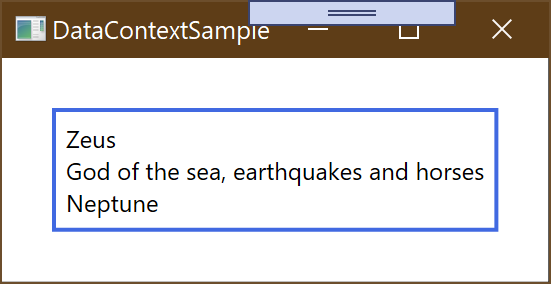

# How should I decide whether to use DataContext or Source?

The **DataContext** is one of the most fundamental concepts in Data Binding. 

The Binding object needs to get its data from somewhere, and there are a few ways to specify the source of the data. In this post I talk about setting the Source property directly in the Binding vs inheriting a DataContext from the nearest element when traversing up in the tree. The other two alternatives are setting the ElementName and RelativeSource properties in the Binding object, but I will leave that for a future post.

For example, let's assume we have the following data sources (GreekGod being a class defined in the code behind):

    <Window.Resources>
        <local:GreekGod Name="Zeus" Description="Supreme God of the Olympians" RomanName="Jupiter" x:Key="zeus"/>
        <local:GreekGod Name="Poseidon" Description="God of the sea, earthquakes and horses" RomanName="Neptune" x:Key="poseidon"/>
    </Window.Resources>

    <StackPanel DataContext="{StaticResource poseidon}">
        <TextBlock TextContent="{Binding Source={StaticResource zeus}, Path=Name}"/>
        <TextBlock TextContent="{Binding Path=Description}"/>
        <TextBlock TextContent="{Binding Path=RomanName}"/>
    </StackPanel>

The first TextBlock inherits the DataContext from the parent StackPanel and has a Source set in the Binding object too. In this case, Source takes priority, causing the TextBlock to bind to the Name property of the resource with key "zeus" - this displays "Zeus".

The second TextBlock does not have a Source set directly in the Binding object, so it inherits the DataContext from the StackPanel. As you might guess, this binds to the Description property of the resource with key "poseidon", displaying "God of the sea, earthquakes and horses".

The third TextBlock should be straightforward - it displays "Neptune".

Most data bound applications I see from users tend to use DataContext much more heavily than Source. My recommendation is to use DataContext only when you need to bind more than one property to a particular source. When binding only one property to a source, I always use Source. The reason for this is ease of debugging - I would rather see all the information about the Binding in one place than search for the nearest DataContext to understand what is going on. In a small sample like the one above there is no big advantage, but in complex applications this could save you some time.

**WPF**

**UWP/Uno Notes**

In UWP it's not very common to reference the Window of the application directly. Instead you can define static resources (in this case the instances of the GreekGod class) at the Application, Page or even Control level. For example, to make the static resource available throughout a given page, we would define them as Page Resources.

    <Page.Resources>
        <local:GreekGod Name="Zeus" Description="Supreme God of the Olympians" RomanName="Jupiter" x:Key="zeus"/>
        <local:GreekGod Name="Poseidon" Description="God of the sea, earthquakes and horses" RomanName="Neptune" x:Key="poseidon"/>
    </Page.Resources>

**UWP**

**WinUI Desktop**
