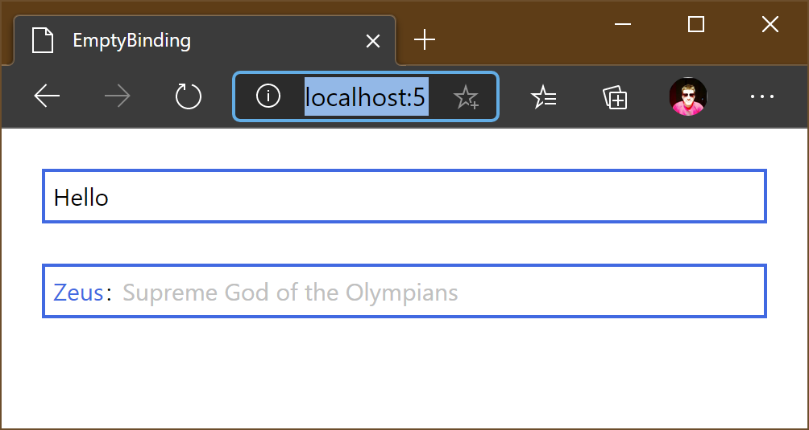

# What does "{Binding}" mean?

Most Bindings you see in samples have the Source and Path properties set. The Source property specifies the object you're binding to and the Path specifies a property in that object whose value you're interested in. I've seen several people get confused when encountering an empty Binding for the first time - "{Binding}". It seems at first sight that we're not giving the Binding enough information to do anything useful. This is not true and I will explain why. If you read my previous post you should understand that it is not necessary to set a Source in a Binding, as long as there is a DataContext set somewhere up in the tree. As for the Path, it should be left out when you want to bind to a whole object, and not only to a single property of an object. One scenario is when the source is of type string and you simply want to bind to the string itself (and not to its Length property, for example).

	<Window.Resources>
		<system:String x:Key="helloString">Hello</system:String>
	</Window.Resources>
	
	<Border DataContext="{StaticResource helloString}">
		<TextBlock TextContent="{Binding}"/>
	</Border>

Another common scenario is when you want to bind some element to an object with several properties.

	<Window.Resources>
		<local:GreekGod Name="Zeus" Description="Supreme God of the Olympians" RomanName="Jupiter" x:Key="zeus"/>
	</Window.Resources>
	
	<Border DataContext="{StaticResource zeus}">
		<ContentControl Content="{Binding}"/>
	</Border>

In this case, ContentControl does not know how to display the GreekGod data. Therefore you will only see the results of a ToString(), which is typically not what you want. Instead, you can use a DataTemplate, which allows you to specify the appearance of your data.

	<Window.Resources>
		<local:GreekGod Name="Zeus" Description="Supreme God of the Olympians" RomanName="Jupiter" x:Key="zeus"/>
		<DataTemplate x:Key="contentTemplate">
			<DockPanel>
				<TextBlock Foreground="RoyalBlue" TextContent="{Binding Path=Name}"/>
				<TextBlock TextContent=":" Margin="0,0,5,0" />
				<TextBlock Foreground="Silver" TextContent="{Binding Path=Description}" />
			</DockPanel>
		</DataTemplate>
	</Window.Resources>
	
	<Border DataContext={StaticResource zeus}">
		<ContentControl Content="{Binding}" ContentTemplate="{StaticResource contentTemplate}"/>
	</Border>

Notice that none of the Binding statements inside the DataTemplate has a Source. That is because a DataContext is automatically set to the data object being templated.

**WPF**

**UWP**

**WASM**

