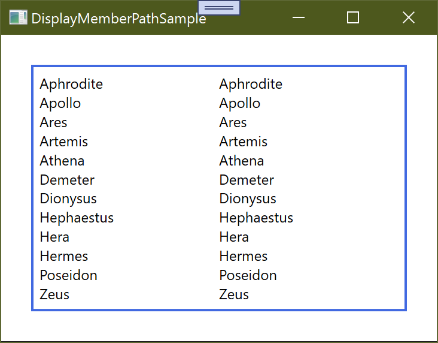
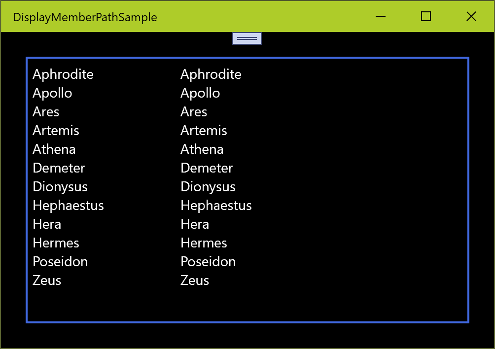

# DisplayMemberPath

As I've shown in previous posts, binding an ItemsControl to an IEnumerable data source is really easy (remember that ListBox and ComboBox derive from ItemsControl). With DisplayMemberPath it's even easier for the scenario where you want to display only one property of each data item as text. Before DisplayMemberPath, this scenario required the use of a DataTemplate that would specify the property we're interested in, like in the following xaml:

	<Window.Resources>
		<DataTemplate x:Key="itemTemplate">
			<TextBlock Text="{Binding Path=Name}" />
		</DataTemplate>
	</Window.Resources>
	
	<ItemsControl ItemsSource="{StaticResource greekGods}" ItemTemplate="{StaticResource itemTemplate}" />

The Data Binding team realized that this was a very common scenario and could be simplified, which was the motivation for introducing the DisplayMemberPath property in ItemsControl. The scenario above can now be done in a single line of xaml:

	<ItemsControl ItemsSource="{StaticResource greekGods}" DisplayMemberPath="Name" />

It's that easy :)

The image below shows both versions of the ItemsControl, the one on the left is using DataTemplate and the one on the right is using DisplayMemberPath.

**WPF**

**UWP**

