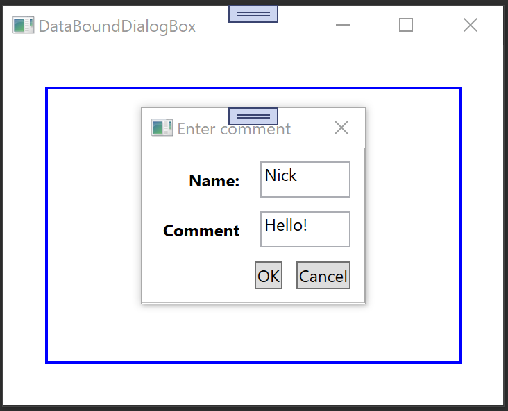
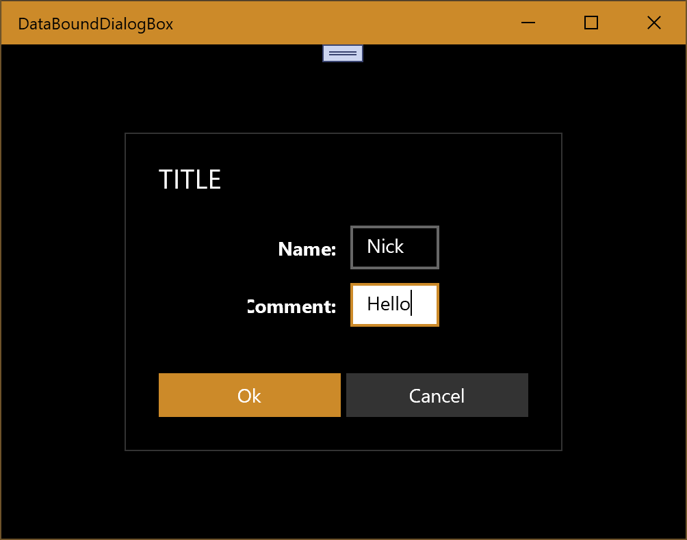
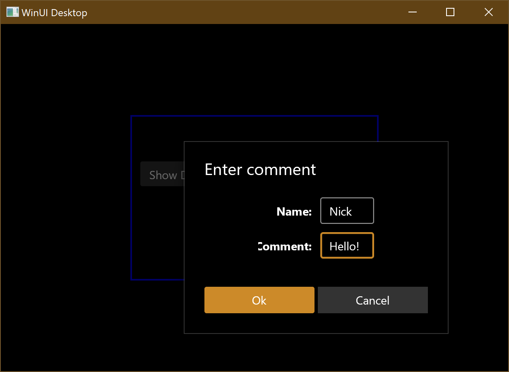

# How to implement a data bound dialog box

In this post I will show you how to implement a dialog box using data binding. While this may seem like a straightforward task at first glance, when using data binding it can be tricky to get the "OK" button of a dialog to commit the user's changes and the "Cancel" button to discard them.

One possible approach is to allow the bindings to update the data source as the user is typing information into the dialog box, then undo the work done by the bindings if the user happens to press the "Cancel" button. I don't like the "Cancel" scenario of this approach because the data source acquires values that are only kept temporarily. Besides, it requires additional logic in the application to remember the data when the dialog box opens and to revert back to that data if the user presses "Cancel". This is a lot of work and quite confusing. Fortunately, there is an easier way to get the job done - by changing the value of UpdateSourceTrigger in your Bindings.

The main Window in this sample has a Button that launches the dialog box, and Labels that show the contents of the data source. When this app is loaded the Labels are empty. When the user opens the dialog box, enters data in the TextBoxes and presses OK, the Labels in the main Window display the data just entered. If the user presses Cancel instead, the Labels should remain empty.

	<Button Click="ShowDialog" Width="100" Height="30">Show Dialog</Button>
	<Label Grid.Row="0" Grid.Column="1" Name="Name" Margin="5" Content="{Binding Source={StaticResource source}, Path=Name}"/>
	<Label Grid.Row="1" Grid.Column="1" Name="Comment" Margin="5" Content="{Binding Source={StaticResource source}, Path=Comment}"/>
	
	private void ShowDialog(object sender, RoutedEventArgs args)
	{
		Dialog1 dialog = new Dialog1();
		dialog.Owner = this;
		dialog.ShowDialog();
	}

The dialog box contains TextBoxes data bound to the same data as the Labels and OK/Cancel Buttons. This is the markup that goes in the dialog box:

	<TextBox Grid.Row="0" Grid.Column="1" Name="Name" Margin="5" Text="{Binding Source={StaticResource source}, Path=Name, UpdateSourceTrigger=Explicit}"/>
	<TextBox Grid.Row="1" Grid.Column="1" Name="Comment" Margin="5" Text="{Binding Source={StaticResource source}, Path=Comment, UpdateSourceTrigger=Explicit}"/>
	<Button Click="OKHandler" IsDefault="true" Margin="5">OK</Button>
	<Button IsCancel="true" Margin="5">Cancel</Button>

The Binding object allows us to specify how to trigger updates to the data source through its UpdateSourceTrigger property. The default update trigger for the TextBox's Text DP is "LostFocus", which means that the data the user types is updated to the source when the TextBox loses focus. This is not what we want for this scenario though; we want the data to be updated only when the user presses the "OK" button. By changing the update trigger to "Explicit", the data will not be updated to the source until we explicitly call the "UpdateSource()" method on the BindingExpression, which we can do in the handler for the "OK" button:

	private void OKHandler(object sender, RoutedEventArgs args)
	{
		BindingExpression bindingExpressionName = BindingOperations.GetBindingExpression(Name, TextBox.TextProperty);
		bindingExpressionName.UpdateSource();
		BindingExpression bindingExpressionComment = BindingOperations.GetBindingExpression(Comment, TextBox.TextProperty);
		bindingExpressionComment.UpdateSource();
		this.DialogResult = true;
	}

The logic for the "OK" button is simple, but the "Cancel" is even simpler. Because we never allowed the values typed to update to the source, all we have to do is close the Window. This can be done by simply setting IsCancel=true on the Cancel button, no event handler necessary.

Here is a screen shot of the completed sample:

**WPF**

**UWP Notes**
The WPF code relies on what seems like magic in order to update the content on the Main page. For those familiar with XAML binding you may be surprised that this example works given that the DataSource class doesn't implement INotifyPropertyChanged. There are definitely smarts built into WPF that will update all elements bound to the same source if one of its properties are updated, such as the case in this example. This does NOT work with UWP where you have to be explicit about raising PropertyChanged event in order for any elements bound to the source to update.

UWP also requires that the Mode of the Binding for the two TextBox elements be set to TwoWay

Additionally, the UWP ContentDialog has built in primary and secondary buttons to encourage a standard look and feel for dialogs. 

**Uno Notes**
Currently the UpdateSourceTrigger attribute of the Binding expression isn't respected. This means that any changes made in the dialog will be updated in the main page.

**UWP**

**WinUI Notes**

WinUI for Desktop, whilst respecting the UpdateSourceTrigger attribute, ends up looking more like UWP than WPF. The dialog needs to inherit from ContentDialog. There's a need to explicitly set the XamlRoot and for some reason typing in the TextBox elements doesn't work.

WinUI for UWP has issues with databound properties being changed in a ContentDialog and having to update on the main page. This is most likely a prerelease issue. Ironically the Uno platforms all update the content but again ignore the UpdateSourceTrigger attribute.

**WinUI - Desktop**

