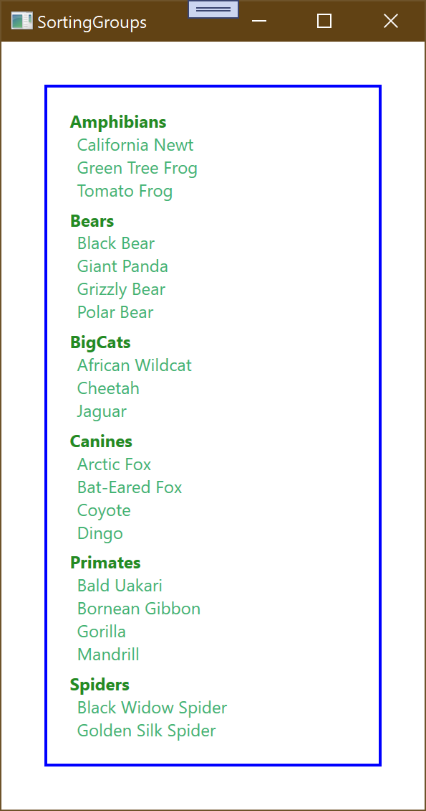
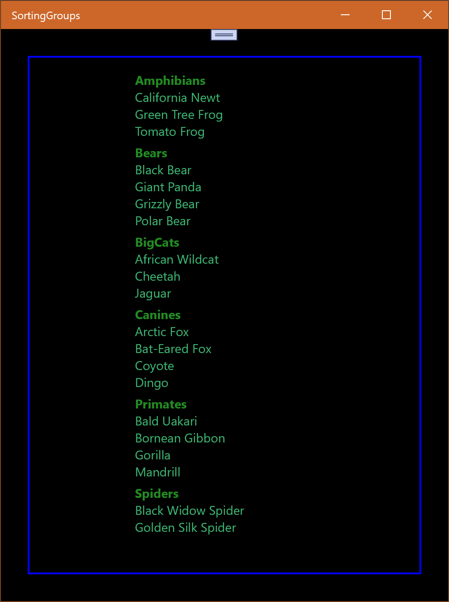
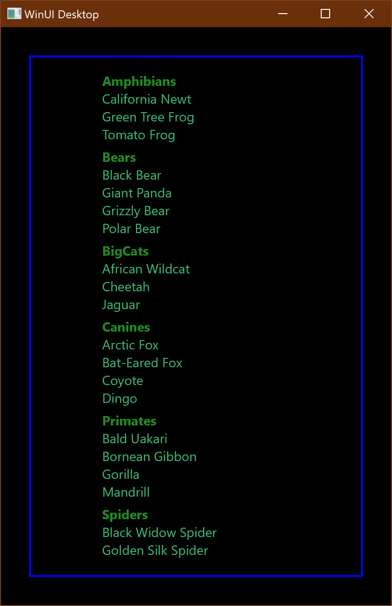

# How to sort groups of data items

With the introduction of CollectionViewSource, we are now able to do basic grouping of data items in an ItemsControl without using code. In this post I will show you how to group items and sort those groups.

The data source of this sample consists of a list of objects of type Animal. Animal has a Name and a Category (which is an enumeration). I want to group the items depending on their Category. This is easily done in markup by using CollectionViewSource:

	<Window.Resources>
		<local:Animals x:Key="animals"/>
	
		<CollectionViewSource x:Key="cvs" Source="{Binding Source={StaticResource animals}, Path=AnimalList}">
			<CollectionViewSource.GroupDescriptions>
				<PropertyGroupDescription PropertyName="Category"/>
			</CollectionViewSource.GroupDescriptions>
		</CollectionViewSource>
	
		<DataTemplate x:Key="animalTemplate">
			<TextBlock Text="{Binding Path=Name}" Foreground="MediumSeaGreen"/>
		</DataTemplate>
	</Window.Resources>
	
	<ItemsControl ItemsSource="{Binding Source={StaticResource cvs}}" ItemTemplate="{StaticResource animalTemplate}"/>

As I explained in a previous post, CollectionViewSource creates a custom View over the source list through markup. A view is a layer on top of a source data list that allows us to group, sort, and filter items, as well as keep track of the currently selected item. 

If you try the sample markup above, you will see the names of the animals, but no information about the groups. The next step is to provide a template to display the group titles. CollectionViewSource wraps each group of items in an object of type CollectionViewGroup, and we are interested in its "Name" property, which we can display using the following template:

	<DataTemplate x:Key="categoryTemplate">
		<TextBlock Text="{Binding Path=Name}" FontWeight="Bold" Foreground="ForestGreen" Margin="0,5,0,0"/>
	</DataTemplate>

In order to use this template for the group titles, we have to add it to the GroupStyle property of ItemsControl (which takes a collection of GroupStyle objects):

	<ItemsControl ItemsSource="{Binding Source={StaticResource cvs}}">
		<ItemsControl.GroupStyle>
			<GroupStyle HeaderTemplate="{StaticResource categoryTemplate}" />
		</ItemsControl.GroupStyle>
	</ItemsControl>

We could add more GroupStyles to the collection, in which case they would be applied to different levels of groups. (For simplicity, we just have one level of grouping in this sample.)

At this point, the groups and items display correctly, but we would like to sort the groups and the items within the groups. I've seen a few people approach this by looking for a specific "SortGroups" method or something similar. We didn't design a special API to sort groups because you can accomplish that simply by sorting the items by the same property by which you are grouping:

	<CollectionViewSource x:Key="cvs" Source="{Binding Source={StaticResource animals}, Path=AnimalList}">
		<CollectionViewSource.GroupDescriptions>
			<PropertyGroupDescription PropertyName="Category"/>
		</CollectionViewSource.GroupDescriptions>
		<CollectionViewSource.SortDescriptions>
			<scm:SortDescription PropertyName="Category" />
			<scm:SortDescription PropertyName="Name" />
		</CollectionViewSource.SortDescriptions>
	</CollectionViewSource>

Adding two sort descriptions allows us to sort the groups first and then the items within the groups. Notice that because Category is an enumeration, sorting by that property will display the groups in the order they are defined in the enumeration (which may or may not be alphabetically). Name is of type string, so the leaf items will be displayed alphabetically.

This is a screenshot of the completed sample:

**WPF**

**UWP Notes**
The UWP CollectionViewSource doesn't support grouping or sort, requiring the underlying data source to be grouped and sorted in advance.

**UWP**

**Uno Notes**
The Uno CollectionViewSource doesn't handle grouped data source. Instead it presents the items in a single list.

**WinUI Notes**
The WinUI CollectionViewSource for both desktop and UWP is similar to the UWP implementation. As such it requires the data source to be grouped and sorted in advance.

**WinUI - Desktop**

